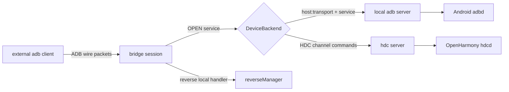

# 代码架构

## 总体结构

```text
src/
  cmd/adb-tcp-bridge/   CLI 入口、参数解析、日志和 Server 组装
  internal/bridge/      TCP listener、ADB 会话、service 转发、reverse 管理
  internal/adbwire/     ADB wire packet 编解码
  internal/adbhost/     本机 adb server host protocol client
  internal/hdcserver/   HDC server 后端与 ADB service 翻译
```

设计中心是 `bridge.DeviceBackend`：上层会话只知道“打开某个 ADB service”和“读取设备属性”，不关心真实目标来自 adb server 还是 HDC server。

```go
type DeviceBackend interface {
    OpenService(ctx context.Context, serial string, service string) (net.Conn, error)
    ReadProperties(ctx context.Context, serial string) (map[string]string, error)
    Description() string
}
```

## 启动路径

1. `main.go` 创建 Cobra root command。
2. CLI 参数被解析为 `bridge.Config`。
3. `newDeviceBackend` 按 `-backend` 选择：
   - `adb`：`bridge.NewADBServerBackend(adbhost.New(serverAddr))`
   - `hdc`：`hdcserver.New(hdcAddr)`
4. `bridge.NewServer` 校验配置、补齐默认值，并通过后端读取设备属性生成 ADB `DeviceID`。
5. `Server.ListenAndServe` 从 `ListenStartPort` 开始监听 TCP，端口占用时向上递增。
6. 每个外部 adb client 连接都会创建一个独立 `session`。

## 核心数据流



## `bridge.Server`

`Server` 负责生命周期边界：

- 校验监听地址、端口、serial/connect key、auth mode。
- 选择默认 host/backend/logger。
- 读取设备属性，生成 ADB `CNXN` 使用的 device banner。
- 创建 TCP listener；端口冲突时从起始端口向上探测。
- 为每个外部连接启动独立 session，并在 context 取消时关闭 listener、等待 session goroutine 退出。

`Server` 不解析 ADB packet，也不理解具体 service；这些职责属于 `session` 和 `service`。

## `bridge.session`

`session` 表示一个外部 adb client 到 bridge 的 ADB transport 会话。职责：

- 读取并分发 ADB packet：`SYNC`、`CNXN`、`AUTH`、`OPEN`、`OKAY`、`WRTE`、`CLSE`、`STLS`。
- 维护 auth 状态、协议版本、最大 payload、local service ID 分配。
- 维护 `localID -> service` 映射。
- 将 `reverse:` 控制 service 路由给本地 `reverseManager`，其余 service 交给后端。
- 串行化对外部 adb client 的 packet 写入，避免多个 service goroutine 并发写同一个连接。

关键约束：

- `CNXN` 不盲目回显新版本。代码固定向经典 `0x01000000` 明文 transport 靠拢，避免现代 adb 因版本协商进入未实现的 STLS 路径。
- `AUTH` 的 `accept-all` 模式不做 RSA 验签；这是功能边界，不是安全认证。
- `STLS` packet 会返回明确错误，当前不支持 TLS transport。

## `bridge.service`

`service` 表示一个 ADB `OPEN` 后形成的流。它把 ADB wire 流控翻译为 `net.Conn` 读写：

- client `OPEN` 普通 service：`service.run` 调用 `DeviceBackend.OpenService`，成功后向 client 回 `OKAY`，再把后端连接读到的数据按 `WRTE` 发回。
- client `WRTE`：`session.handleWrite` 把 payload 写入 service 的后端连接，然后回 `OKAY`。
- 后端到 client 的 `WRTE`：`sendWriteAndWaitAck` 发送后阻塞等待对端 `OKAY`，保持 ADB 写入流控。
- `CLSE`、读错、context 取消都会收敛到 `finish`，移除 service 并发送必要的 `CLSE`。

反向连接使用同一个 service 抽象，但方向相反：`runOutbound` 先向外部 adb client 发送 `OPEN`，等待 client `OKAY` 后开始转发本地 listener 接收到的数据。

## `bridge.reverseManager`

`reverseManager` 是 session 内的本地 handler，仅处理 `reverse:` service。它负责：

- `forward`：在 bridge 本机监听 `127.0.0.1:<port>`，同时调用设备侧 `reverse:forward...` 建立映射。
- `killforward` / `killforward-all`：关闭本地 listener，并通知设备侧撤销映射。
- `list-forward`：返回当前 session 内维护的 reverse 映射。
- listener accept 到真实连接后，通过 `session.openOutbound` 向外部 adb client 发起 ADB `OPEN`，代理反向数据流。

映射作用域是单个 session；session 关闭会清理该 session 的所有 reverse listener。

## 后端层

### ADB server 后端

`bridge.adbServerBackend` 是 `adbhost.Client` 的薄适配器。每次打开 service 时：

1. 连接本机 adb server。
2. 发送 `host:transport:<serial>`。
3. 发送目标 service 名称。
4. 清除命令阶段 deadline，进入长期流式连接。

### HDC server 后端

`hdcserver.Backend` 将有限的 ADB service 翻译为 HDC server 命令：

- `shell:` / `exec:`：打开 HDC shell channel；shell v2 会在 ADB shell v2 packet 与 HDC channel payload 之间转换。
- `sync:`：用 `net.Pipe` 暴露一个 ADB sync 连接，在 goroutine 中处理 `STAT`、`LIST`、`SEND`、`RECV`。
- `localabstract:` / `localfilesystem:` / `localreserved:` / `tcp:` / `local:`：通过 HDC `fport` 在本机临时监听 TCP，再 dial 到该端口得到流式连接；关闭时 `fport rm` 撤销规则。
- 设备属性：读取 `list targets -v`，再用 `shell param get ...` 补齐产品名称、型号和设备名。

不在上述范围内的 service 会返回 `hdc backend does not support adb service ...`。

## 并发和关闭模型

- 一个 TCP client 连接对应一个 `session.run` goroutine。
- 每个 `OPEN` service 会启动自己的转发 goroutine。
- `session.writeMu` 保护 ADB packet 写入；`service.connMu` 保护底层 `net.Conn` 指针；service 的 `done` channel 负责关闭广播。
- session 关闭时会复制并清空 service map，然后逐个关闭 service，最后清理 reverse mappings 并关闭 TCP 连接。
- server context 取消时关闭 listener，停止接收新连接，并等待已启动 session 结束。

## 扩展点

- 新增真实设备后端：实现 `bridge.DeviceBackend`，在 CLI 的 `newDeviceBackend` 中注册。
- 新增本地合成 service：在 `session.localHandler` 按 service 前缀登记 handler，避免把特殊控制流塞进普通转发路径。
- 扩展 HDC 支持：优先在 `hdcserver.Backend.OpenService` 明确列出可支持的 ADB service；不要让未知 service 静默降级。
